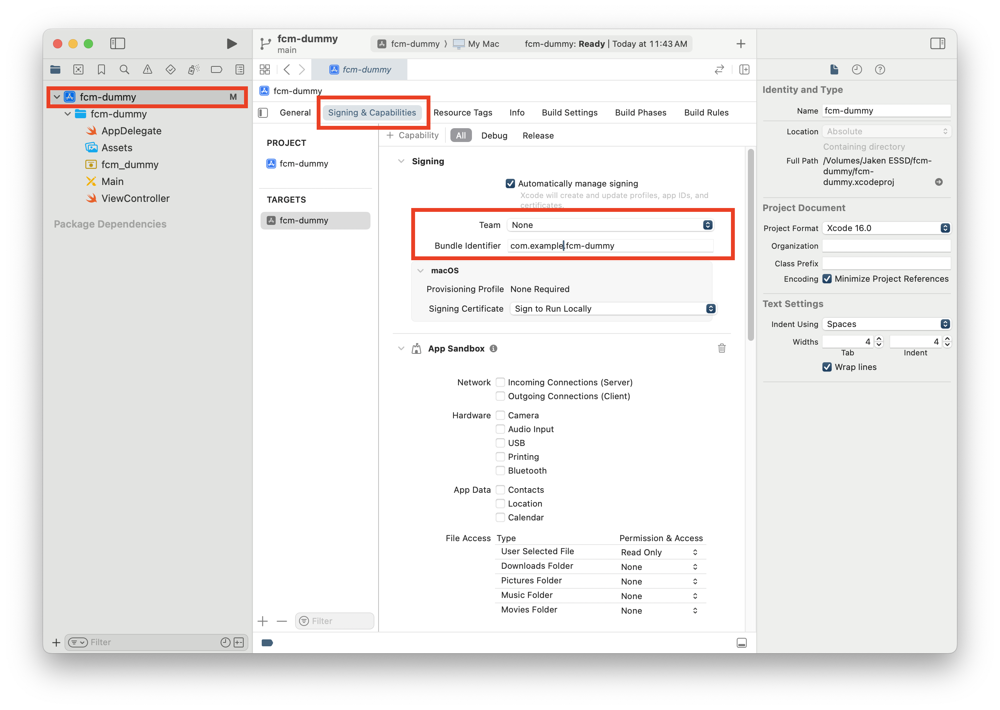
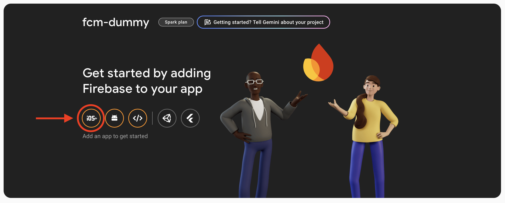
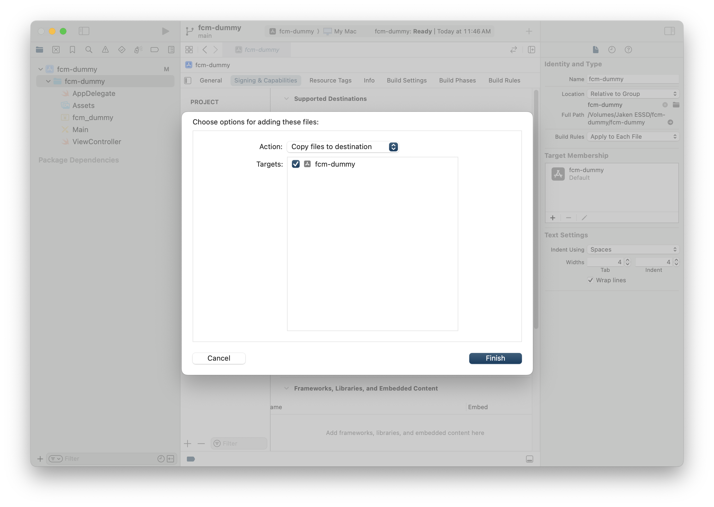
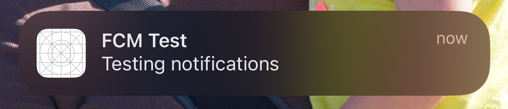

# FCM Dummy (iOS)

This project serves as a skeleton iOS project to test backend implementations of Firebase Cloud Messaging. Once you've set this project up on your local machine, you'll be able to test your functions that send notifications through FCM.

> [!CAUTION]
> You will need an active Apple Developer Program membership to proceed.

## iOS Skeleton App Initial Setup

### Team & Bundle Identifier
This is a skeleton Xcode project. You'll need to set your own **Team** and **Bundle Identifier**. To do this, select the project in the explorer and set your **Team** in the Signing & Capabilities tab (see below):

## Apple Account Setup

### Create a CSR
Before we can create the APNs authentication key needed to broadcast notifications, we need a CSR. To create this:
 - Launch Keychain Access located in `/Applications/Utilities`. (It's easiest to use <kbd>Cmd</kbd> + <kbd>Space</kbd> to use spotlight to find it)
 - Choose Keychain Access > Certificate Assistant > Request a Certificate from a Certificate Authority.
 - In the Certificate Assistant dialog, enter an email address in the User Email Address field.
 - In the Common Name field, enter a name for the key (for example, FCM Dummy Dev Key).
 - Leave the CA Email Address field empty.
 - Choose “Saved to disk,” then click Continue.

### Obtain APNs authentication key
In order to send notifications to your application, you'll need to get an APNs authentication key. To obtain this key, go to the [Apple Developer Member Center](https://developer.apple.com/membercenter/index.action), and navigate to "Keys", under "Certificates, IDs, & Profiles". Press the blue "+" button to create a new key. Name the key whatever you want, and make sure you "Enable" the "Apple Push Notifications service (APNs)" option. Press "Continue" followed by "Register" and "Download". We'll use that key in the Firebase setup.

### Obtain Development SSL Certificate
In order to send notifications to your application, you'll need to get a development SSL certificate. To obtain this, go to the [Apple Developer Member Center](https://developer.apple.com/membercenter/index.action), and navigate to "Identifiers", under "Certificates, IDs, & Profiles". Press the blue "+" button to create a new identifier. 
 - In "Description", this can be whatever you want. I put "FCM Dummy".
 - In the "Bundle ID" field, you need to set this to the same bundle identifier that you made in the **Team & Bundle Identifier** step of this document.
 - Under capabilities, select "Push Notifications" and make sure "Broadcast Capability" is also selected.
 - Press "Continue", then "Register".
 - Now, we need the certificate. From the list of identifiers, click the one you just created.
 - Scroll down the capabilities list to get to "Push Notifications". You should now see a "Configure" button. Press it.
 - Under "Development SSL Certificate", press "Create Certificate".
 - Select "Choose file" and select the CSR file you created in the **Create a CSR** step of this document.
 - Press "Continue" followed by "Download"

We'll use that certificate in the Firebase setup.

## Firebase Initial Setup

### Project setup
For testing, create a "dummy" project in Firebase. This is to ensure that we don't accidentally send notifications to the production project. There are other ways to do this, but this nuclear option feels safest. To do this:
 
 1. Go to the [Firebase Console](https://console.firebase.google.com/) and select "Create a Project".
 2. For the project name, you can use `fcm-dummy`, or choose your own.
 3. Decide for yourself whether you want to opt-in to Google Analytics or not. For most basic implentation/test cases, you can just select to opt-out.

### Create an iOS App on Firebase
Now that you've set up your project, you'll see a hero banner on your project's console page. Click the **iOS** button to add an iOS application to your project:

When you click that button, you'll be direct to a page called **Add Firebase to your Apple app**. On this page, there are 5 steps: _Register app_, _Download config file_, _Add Firebase SDK_, _Add initialization code_, and _Next steps_. You should only need to do the "_Register app_ " and "_Download config file_" steps. Everything else has been checked in to this repository.

Let's begin. First step, _Register app_. Here, you'll **only** need to set the Apple bundle ID. Set this to the same thing you set it to in the **Team & Bundle Identifier** portion of this documentation. 

Click the blue "Register app" button.

Now, click the blue "Download GoogleService-Info.plist" button, which downloads a file called `GoogleService-Info.plist`. Place this in the root of the Xcode project (You can drag-and-drop the file from your downloads folder into the Xcode explorer window. Make sure the target is selected and the action is set to "Copy files to destination"):

Back in Firebase, click the blue "Next" button. This takes you to the *Add Firebase SDK* step. This has already been done and checked in to this repo, but you can verify this looking at the "Package Dependencies" section of the Xcode explorer.

Click the blue "Next" button to move on to the next step. Now we're on the *Add initialization code* step, which has already been done for you.

Click the blue "Next" button to move on to the next step, them immediately click the blue "Continue to console" button.

### Add APNs config to Firebase
Now that you've created an iOS project on your Firebase project, in the hero section of the Firebase console, you'll see a purple iOS logo with your selected bundle identifier. Click on that, followed by the cogwheel that appears when you do. You're now at the **Project Settings** page on the *General* tab. Change the tab to *Cloud Messaging*.

Under "Apple app configuration", you'll see an area titled **APNs Authentication Key**. Where it says "No APNs auth key", press "Upload" and upload the key you created in the **Obtain APNs authentication key** step of this document. Your Key ID can be found at developer.apple.com under "Keys" (In Certificates, IDs, & Profiles). Your Team ID can be found at developer.apple.com. Just scroll down until you see **Membership Details**.

## Test Notifications
Run the build on Xcode (must be either a physical iPhone device or an iOS simulator). You'll be prompted on your iOS device to allow notifications. Press Allow. Now, on the Firebase console, in the lefthand side of the menu where it says "Build, Run, Analytics" - expand "Run" and press "Messaging".

Select "Create your first campaign" and choose "Firebase Notification messages" as the message type, and press "Create". For the notification title, put "FCM Dummy", for the notification text put "Testing notifications", then press "Next".

Change the selection from "User segment" to "Topic" and send a message to the "public" topic (this is what is automatically subscribed to when we run the fcm-dummy iOS application on our device). Select "Review" (skipping steps 3 and 4). Press "Publish".

Congrats - you've set up an iOS project to test notifications with.